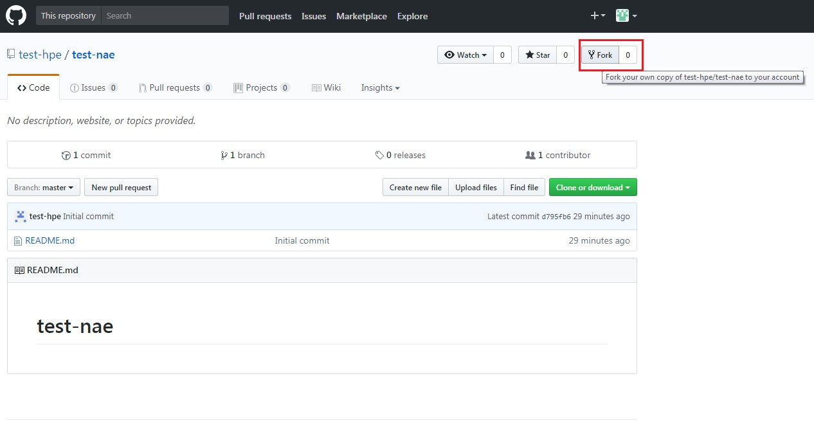
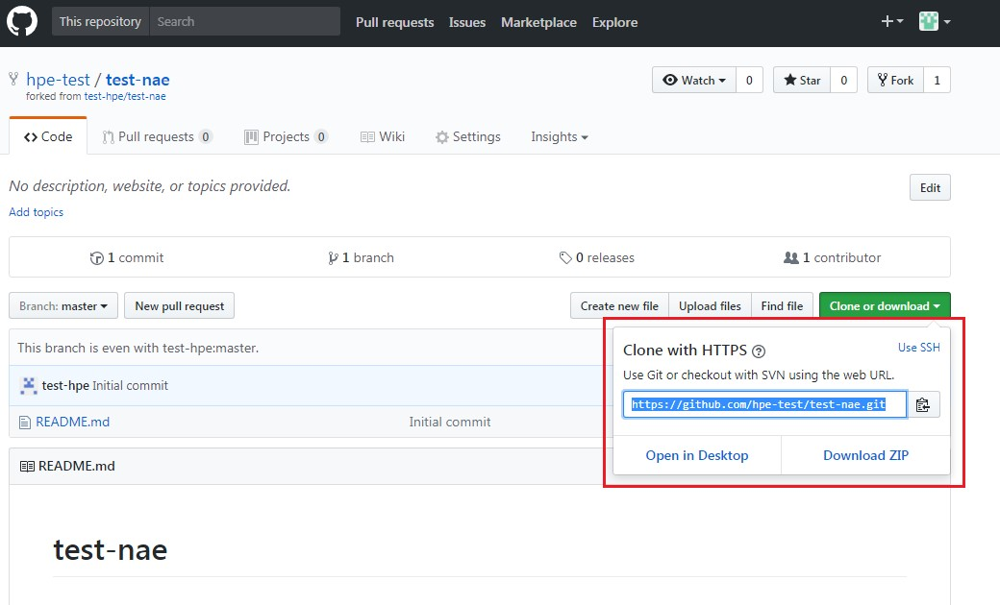
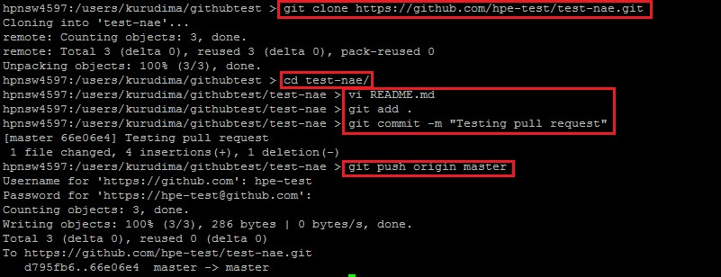
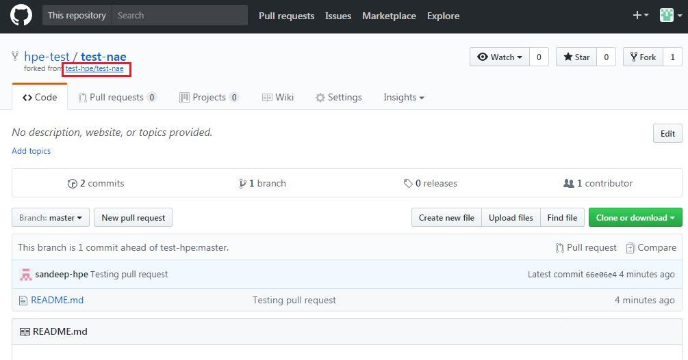
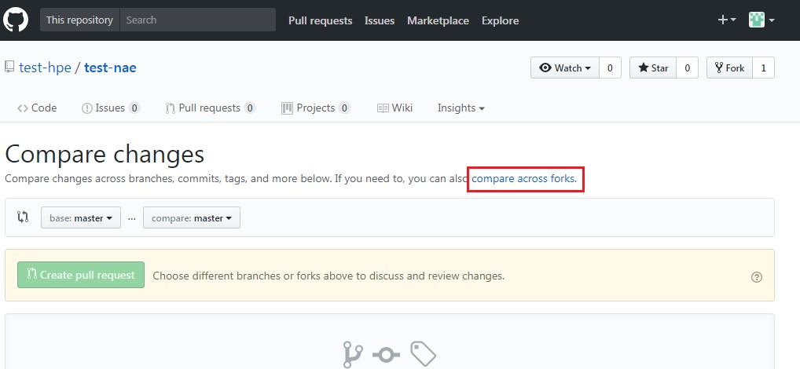
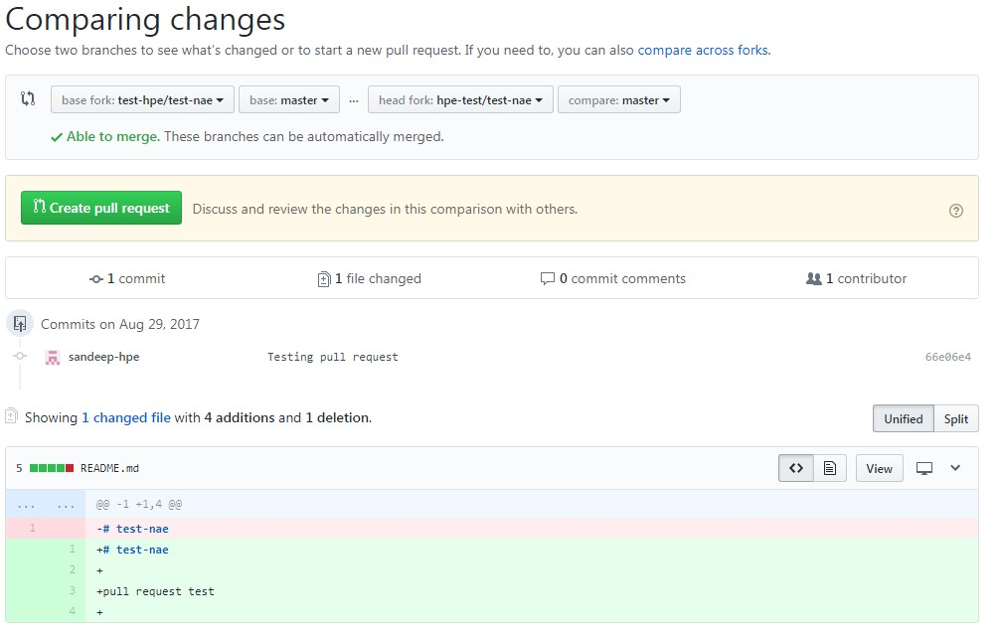

------------------------------------------------------------------------------

### Overview

------------------------------------------------------------------------------

Aruba Network Analytics Engine Scripts are troubleshooting solutions that 
allow the administrator to monitor data of a specific resource
(protocol/system) and capture time series snapshot of various possible
states that this resource can transition to.

The administrator creates scripts that are based on NAE framework. A script 
indicates what data should be monitored, specifies conditions which act as 
triggers on the monitored data, specifies pre-defined actions 
(e.g. syslog, cli commands, etc) that can be executed when the condition is
met, or indicate callback actions which are nothing but python functions to
be executed when the condition is met.

Once the Network Analytics Script is uploaded and instantiated, Time Series
data collection will begin, based on the data that is monitored. The 
administrator views Time Series data associated with Network Analytics Agents
as charts on the Web UI.

------------------------------------------------------------------------------

### Contents

------------------------------------------------------------------------------
- [Repository Links](#repo_links)
- [Repository Structure](#repo_structure)
- [Contributing to Repository](#repo_contribution)

------------------------------------------------------------------------------

#### Repository Links:

------------------------------------------------------------------------------
The GitHub repository will be a part of the “aruba” organization on GitHub: 

https://github.com/aruba/nae-scripts

------------------------------------------------------------------------------

#### Repository Structure:

------------------------------------------------------------------------------
Structure of the “nae-scripts” repository is as shown below
<pre>
	├── agents
	├── examples
	├── images
	├── LICENSE.md
	├── README.md
	└── Release-Notes
</pre>

- #### agents:

Folder containing all agents (python scripts).  The scripts 
reside inside various functionality/protocol specific folders so that the 
network administrator can choose an area they want to monitor and explore the 
scripts under that area. Within each area, the scripts will reside inside the
platform specific folder (“8400” as seen below)
<pre>
	├── Interface
	│   └── 8400
	├── OSPFv2
	│   └── 8400
	├── Port
	│   └── 8400
	├── STP
	│   └── 8400
	├── System_Daemons
	    └── 8400
</pre>
Inside each folder, you will find the actual script and the documentation 
around that script: 
<pre>
	├── interface_state_stats_monitor.1.0.md
	└── interface_state_stats_monitor.1.0.py
</pre>

- #### examples:
	Folder containing simple examples for agents monitoring switch
	functionality/protocols. These can be used as sample scripts.
<pre>
	├── CoPP
	├── Interface
	├── LAG
	├── OSPFv2
	├── Port
	├── STP
	├── System
	└── VRRP
</pre>

- #### images:
	Folder containing images used in the Readme file.

- #### license: 
	Apache 2.0 license file

- #### README:
	How to use this repository 

- #### Release-Notes:
	version by version notes for agents on the repository. 
	Known issues, Fixed issues etc.

------------------------------------------------------------------------------

#### Contributing to Repository:

The usage of the repository is like any other GitHub repository. Use the 
pull-request process to propose any additions or changes to the agents.

<pre>
<b>Important Note:  The NAE Agents repository “nae-scripts” will accept NAE 
Agents from HPE teams only for its first release. Customers can use content 
from this repository to create their own enhanced NAE Agents.</b>
</pre>

1. Login with your account
2. Search for the repository that you are interested in.
3. Click on the repository to open the main page and click on fork:

4. The repo will get forked under your profile. Click on Your 
Profile -> Repositories -> <reponame> and copy the clone URL

5. Perform the following on your local system where git is installed
	- Clone repo
	- make changes 
	- push the commit.

6. Go back to the original repo by clicking on the "forked from" button:

7. Click on Pull requests ->  New pull request -> compare across forks:

8. Select "base fork" as the Original repo and "head fork" as the local forked
repo. And click on Create pull request and submit it.

 
9. The original repo owner can then review your pull request and merge to the
specified branch.

10. More links :
	- https://git-scm.com/
	- https://git-scm.com/docs

